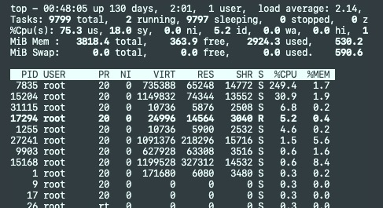

# 测试文档

这个文档记录 EasyServer 相关的测试结果，包括：

1. 功能测试
2. 性能测试
3. 内存检查

以下将按照上述分类对测试结果进行分析记录。

---

## 功能测试

功能测试目前主要分为如下几个部分：

1. 线程池测试
2. 同步日志测试
3. 异步日志测试
4. 服务器功能测试

### 线程池测试 test_ThreadPool

线程池线程数设置为8，任务数量设置为1e6。运行 test_ThreadPool，结果如下：

```
RUN THREADPOOL FUNCTION TEST
Thread 139932610426624 executed 126945 tasks.
Thread 139932627212032 executed 126791 tasks.
Thread 139932643997440 executed 127113 tasks.
Thread 139932660782848 executed 125095 tasks.
Thread 139932652390144 executed 120382 tasks.
Thread 139932618819328 executed 129201 tasks.
Thread 139932602033920 executed 124514 tasks.
Thread 139932635604736 executed 119959 tasks.
total tasks : 1000000, Cost time : 5198000000ms
```

线程池功能正常。

### 同步日志测试 test_synLog

日志数量设置为 1e6 * 5，文件分割大小设置为 200 Mb，结果如下：

```
SynLogger cost time = 44139 ms
```

生成的日志文件如下：

```
├── test-Synlog-20220719-220016.EasyTencentCloud.log
├── test-Synlog-20220719-220018.EasyTencentCloud.log
├── test-Synlog-20220719-220020.EasyTencentCloud.log
├── test-Synlog-20220719-220022.EasyTencentCloud.log
├── test-Synlog-20220719-220024.EasyTencentCloud.log
├── test-Synlog-20220719-220026.EasyTencentCloud.log
├── test-Synlog-20220719-220028.EasyTencentCloud.log
├── test-Synlog-20220719-220031.EasyTencentCloud.log
├── test-Synlog-20220719-220033.EasyTencentCloud.log
├── test-Synlog-20220719-220035.EasyTencentCloud.log
├── test-Synlog-20220719-220037.EasyTencentCloud.log
├── test-Synlog-20220719-220039.EasyTencentCloud.log
├── test-Synlog-20220719-220041.EasyTencentCloud.log
├── test-Synlog-20220719-220043.EasyTencentCloud.log
├── test-Synlog-20220719-220045.EasyTencentCloud.log
├── test-Synlog-20220719-220047.EasyTencentCloud.log
├── test-Synlog-20220719-220050.EasyTencentCloud.log
├── test-Synlog-20220719-220052.EasyTencentCloud.log
├── test-Synlog-20220719-220054.EasyTencentCloud.log
├── test-Synlog-20220719-220056.EasyTencentCloud.log
├── test-Synlog-20220719-220058.EasyTencentCloud.log
```

同步日志功能正常。

### 异步日志测试

日志数量设置为 1e6 * 5，文件分割大小设置为 500 Mb，结果如下：

```
AsynLogger cost time = 19768 ms
```

生成的日志文件如下：

```
├── test-AsynLog-20220719-220555.EasyTencentCloud.23095.log
├── test-AsynLog-20220719-220600.EasyTencentCloud.23095.log
├── test-AsynLog-20220719-220603.EasyTencentCloud.23095.log
├── test-AsynLog-20220719-220607.EasyTencentCloud.23095.log
├── test-AsynLog-20220719-220611.EasyTencentCloud.23095.log
```

异步日志功能正常。

### 服务器功能测试

本处仅测试服务的 get 功能，在运行目录下放置了一个简单的 index.html。更复杂的功能测试可以使用提供的文件运行 server，使用浏览器进行测试。

首先运行 server，测试时设置端口号为1316，server 的工作线程数设置为 4，然后进行测试，结果如下：

```
1:
strlen(p) = 1
n=-1

2:
strlen(p) = 13
n=247
HTTP/1.1 404 Not Found
Connection: close
Content-type: text/html
Server: EasyServer
Content-length: 136

<html><title>QAQ EASY NOT EASY</title><body bgcolor="ffffff">404 : Not Found
<p>File Not Found</p><hr><em>EasyServer</em>
</body></html>

3:
strlen(p) = 113
n=113
HTTP/1.1 200 OK
Connection: close
Content-type: text/html
Server: EasyServer
Content-length: 10

TEST PAGE
```

测试阶段生成的日志如下：

```
2022-07-19 22:30:13-962 tid:26086  EventLoop.cpp[Line:99] - [TRACE]: EventLoop starts looping, thread : 26086 
2022-07-19 22:30:13-963 tid:26087  EventLoop.cpp[Line:99] - [TRACE]: EventLoop starts looping, thread : 26087 
2022-07-19 22:30:13-963 tid:26088  EventLoop.cpp[Line:99] - [TRACE]: EventLoop starts looping, thread : 26088 
2022-07-19 22:30:13-964 tid:26089  EventLoop.cpp[Line:99] - [TRACE]: EventLoop starts looping, thread : 26089 
2022-07-19 22:30:13-964 tid:26084  Server.cpp[Line:47] - [INFO ]: EasyServer STARTED
2022-07-19 22:30:13-964 tid:26084  EventLoop.cpp[Line:99] - [TRACE]: EventLoop starts looping, thread : 26084 
2022-07-19 22:30:22-509 tid:26084  Server.cpp[Line:78] - [INFO ]: New Connection from 127.0.0.1:52200, userCount : [1]
2022-07-19 22:30:22-510 tid:26086  HttpRequest.cpp[Line:49] - [ERROR]: RequstLine Error
2022-07-19 22:30:22-510 tid:26086  HttpData.cpp[Line:152] - [ERROR]: HttpData handleError, fd : 15, ereCode : 400, msg : Bad Request : parse request error
2022-07-19 22:30:23-509 tid:26086  HttpData.cpp[Line:158] - [INFO ]: Connection 15 close, userCount : [0]
2022-07-19 22:30:24-509 tid:26084  Server.cpp[Line:78] - [INFO ]: New Connection from 127.0.0.1:52202, userCount : [1]
2022-07-19 22:30:24-510 tid:26087  HttpRequest.cpp[Line:169] - [TRACE]: [GET], [], [1.1] 
2022-07-19 22:30:24-510 tid:26087  HttpData.cpp[Line:152] - [ERROR]: HttpData handleError, fd : 15, ereCode : 404, msg : Response error
2022-07-19 22:30:24-510 tid:26087  HttpData.cpp[Line:158] - [INFO ]: Connection 15 close, userCount : [0]
2022-07-19 22:30:26-509 tid:26084  Server.cpp[Line:78] - [INFO ]: New Connection from 127.0.0.1:52204, userCount : [1]
2022-07-19 22:30:26-511 tid:26088  HttpRequest.cpp[Line:169] - [TRACE]: [GET], [/index.html], [1.1] 
2022-07-19 22:30:26-511 tid:26088  HttpResponse.cpp[Line:120] - [TRACE]: file path /root/WorkSpace/EasyServer/build/bin/index.html 
2022-07-19 22:30:27-509 tid:26088  HttpData.cpp[Line:158] - [INFO ]: Connection 15 close, userCount : [0]
```

可以看到，服务器功能正常。

### CTest

最后使用 CTest 整体进行测试，结果如下：

```
[proc] Executing command: /usr/bin/ctest -j6 -C Debug -T test --output-on-failure
[ctest]    Site: EasyTencentCloud
[ctest]    Build name: Linux-g++
[ctest] Test project /root/WorkSpace/EasyServer/build
[ctest]     Start 3: test_asynLog
[ctest]     Start 2: test_ThreadPool
[ctest]     Start 5: test_syncLog
[ctest]     Start 4: test_server
[ctest]     Start 1: test_LogGenerate
[ctest] 1/5 Test #4: test_server ......................   Passed    5.02 sec
[ctest] 2/5 Test #1: test_LogGenerate .................   Passed    8.78 sec
[ctest] 3/5 Test #2: test_ThreadPool ..................   Passed   11.22 sec
[ctest] 4/5 Test #3: test_asynLog .....................   Passed   23.58 sec
[ctest] 5/5 Test #5: test_syncLog .....................   Passed   54.87 sec
[ctest] 
[ctest] 100% tests passed, 0 tests failed out of 5
[ctest] 
[ctest] Total Test time (real) =  54.87 sec
[ctest] CTest finished with return code 0
```

测试通过。

---

## 性能测试

测试环境为腾讯云轻量级应用服务器，配置为 4 核 4 GB 内存，但是由于服务器上还运行了其他任务，可能无法完全发挥性能，只作为参考。

EasyServer 的运行参数设置为8个工作线程，开启异步日志。

使用的测试工具为 WebBench，由于性能限制，并发连接总数设置为 8000，连接时间设置为 10s。测试运行命令如下：

```
webbench -c 8000 -t 10 http://127.0.0.1:1316/index.html
```

测试结果如下：

```
Webbench - Simple Web Benchmark 1.5
Copyright (c) Radim Kolar 1997-2004, GPL Open Source Software.

Benchmarking: GET http://127.0.0.1:1316/
8000 clients, running 10 sec.

Speed=67278 pages/min, 383397 bytes/sec.
Requests: 11213 susceed, 0 failed.
```

附测试时服务器负载情况：



测试结果由于性能限制，仅供参考。

---

## 内存检查

内存检查部分，使用 Valgrind 的 memcheck 工具对 EasyServer 的相关功能进行检查。检查代码使用功能测试中编写的代码。

Valgrind 的参数设置为：

```
--tool=memcheck --leak-check=full --show-reachable=yes --trace-children=yes
```

### 线程池 test_ThreadPool

线程池线程数设置为8，任务数量设置为1e7，结果如下：

```bash
$ valgrind --tool=memcheck --leak-check=full --show-reachable=yes --trace-children=yes ./build/bin/test_ThreadPool
==1871== Memcheck, a memory error detector
==1871== Copyright (C) 2002-2022, and GNU GPL'd, by Julian Seward et al.
==1871== Using Valgrind-3.19.0 and LibVEX; rerun with -h for copyright info
==1871== Command: ./build/bin/test_ThreadPool
==1871== 
RUN THREADPOOL FUNCTION TEST
Thread 121329408 executed 18585 tasks.
Thread 129722112 executed 74867 tasks.
Thread 146507520 executed 1227215 tasks.
Thread 112936704 executed 766268 tasks.
Thread 96151296 executed 30470 tasks.
Thread 154900224 executed 363756 tasks.
Thread 104544000 executed 268172 tasks.
Thread 138114816 executed 292940 tasks.
total tasks : 3042273, Cost time : 104871000000ms
==1871== 
==1871== HEAP SUMMARY:
==1871==     in use at exit: 0 bytes in 0 blocks
==1871==   total heap usage: 625,101 allocs, 625,101 frees, 341,051,270 bytes allocated
==1871== 
==1871== All heap blocks were freed -- no leaks are possible
==1871== 
==1871== For lists of detected and suppressed errors, rerun with: -s
==1871== ERROR SUMMARY: 0 errors from 0 contexts (suppressed: 0 from 0)
```

可以看到线程池测试中并无内存泄漏的情况出现。

### 同步日志 test_synLog

生产的同步日志数量设置为 1e5 * 5，测试结果如下：

```bash
$ valgrind --tool=memcheck --leak-check=full --show-reachable=yes --trace-children=yes ./build/bin/test_syncLog
==3912== Memcheck, a memory error detector
==3912== Copyright (C) 2002-2022, and GNU GPL'd, by Julian Seward et al.
==3912== Using Valgrind-3.19.0 and LibVEX; rerun with -h for copyright info
==3912== Command: ./build/bin/test_syncLog
==3912== 
SynLogger cost time = 183245 ms
==3912== 
==3912== HEAP SUMMARY:
==3912==     in use at exit: 0 bytes in 0 blocks
==3912==   total heap usage: 84 allocs, 84 frees, 151,031 bytes allocated
==3912== 
==3912== All heap blocks were freed -- no leaks are possible
==3912== 
==3912== For lists of detected and suppressed errors, rerun with: -s
==3912== ERROR SUMMARY: 0 errors from 0 contexts (suppressed: 0 from 0)
```

可以看到同步日志测试中无内存泄漏的情况出现。

### 异步日志 test_asynLog

生产的异步日志数量设置为 1e5 * 5，测试结果如下：

```bash
$ valgrind --tool=memcheck --leak-check=full --show-reachable=yes --trace-children=yes ./build/bin/test_asynLog 
==5620== Memcheck, a memory error detector
==5620== Copyright (C) 2002-2022, and GNU GPL'd, by Julian Seward et al.
==5620== Using Valgrind-3.19.0 and LibVEX; rerun with -h for copyright info
==5620== Command: ./build/bin/test_asynLog
==5620== 
AsynLogger cost time = 104428 ms
==5620== 
==5620== HEAP SUMMARY:
==5620==     in use at exit: 0 bytes in 0 blocks
==5620==   total heap usage: 119 allocs, 119 frees, 54,678,959 bytes allocated
==5620== 
==5620== All heap blocks were freed -- no leaks are possible
==5620== 
==5620== For lists of detected and suppressed errors, rerun with: -s
==5620== ERROR SUMMARY: 0 errors from 0 contexts (suppressed: 0 from 0)
```

可以看到异步日志测试中无内存泄漏的情况出现。

### 服务器 tese_server

首先运行 server，测试时设置端口号为1316，然后进行测试，结果如下：

```bash
$ valgrind --tool=memcheck --leak-check=full --show-reachable=yes --trace-children=yes ./build/bin/test_server
==9479== Memcheck, a memory error detector
==9479== Copyright (C) 2002-2022, and GNU GPL'd, by Julian Seward et al.
==9479== Using Valgrind-3.19.0 and LibVEX; rerun with -h for copyright info
==9479== Command: ./build/bin/test_server
==9479== 
1:
strlen(p) = 1
n=-1

2:
strlen(p) = 13
n=247
HTTP/1.1 404 Not Found
Connection: close
Content-type: text/html
Server: EasyServer
Content-length: 136

<html><title>QAQ EASY NOT EASY</title><body bgcolor="ffffff">404 : Not Found
<p>File Not Found</p><hr><em>EasyServer</em>
</body></html>

3:
strlen(p) = 113
n=113
HTTP/1.1 200 OK
Connection: close
Content-type: text/html
Server: EasyServer
Content-length: 10

TEST PAGE
==9479== 
==9479== HEAP SUMMARY:
==9479==     in use at exit: 0 bytes in 0 blocks
==9479==   total heap usage: 51 allocs, 51 frees, 76,518 bytes allocated
==9479== 
==9479== All heap blocks were freed -- no leaks are possible
==9479== 
==9479== For lists of detected and suppressed errors, rerun with: -s
==9479== ERROR SUMMARY: 0 errors from 0 contexts (suppressed: 0 from 0)
```

可以看到服务器测试中无内存泄漏情况出现。